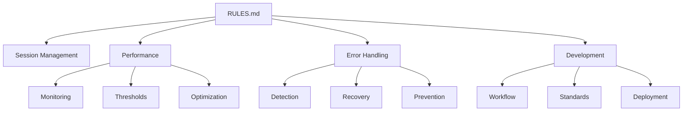

# Project Rules and Guidelines

This document serves as the main entry point for all project rules and guidelines. Each section links to detailed documentation in the `docs/` directory.

## Quick Access

### For AI Assistants
1. **Session Management**: Start here at the beginning of each session
   - [Session Management Rules](./docs/session-management.md)
   - Required reading at session start
   - Includes memory and performance guidelines

2. **User Interaction**
   - [User Interaction Guidelines](./docs/user-interaction.md)
   - Critical for all user communications
   - Defines response formats and protocols

3. **Development Process**
   - [Development Workflow](./docs/development-workflow.md)
   - [Project Standards](./docs/project-standards.md)
   - Follow these for all code changes

### For Performance and Error Handling
1. **Performance Management**
   - [Performance Overview](./docs/performance/README.md)
   - [Monitoring Rules](./docs/performance/monitoring.md)
   - [Threshold Guidelines](./docs/performance/thresholds.md)
   - [Optimization Strategies](./docs/performance/optimization.md)

2. **Error Management**
   - [Error Handling Overview](./docs/errors/README.md)
   - [Detection Guidelines](./docs/errors/detection.md)
   - [Recovery Procedures](./docs/errors/recovery.md)
   - [Prevention Strategies](./docs/errors/prevention.md)

### For Project Management
1. **Communication**
   - [Communication Guidelines](./docs/communication.md)
   - Includes formatting and response protocols

2. **Maintenance**
   - [Maintenance Procedures](./docs/maintenance.md)
   - Regular upkeep and technical debt management

3. **Deployment**
   - [Deployment Guidelines](./docs/deployment.md)
   - Build and release procedures

## Document Updates

When any rules document is updated:
1. Update relevant section in `docs/`
2. Update cross-references if needed
3. Update this index if new sections added
4. Record changes in `SESSIONS.md`
5. Update `.checksums.json`

## Required Reading Order

AI assistants must read documents in this order at session start:
1. `RULES.md` (this file) - Main router
2. `docs/session-management.md` - Session handling
3. `SESSIONS.md` - Current context
4. Relevant section docs based on current task

## Cross-Reference Map



## File Locations

- Main Rules: `/RULES.md`
- Documentation: `/docs/*`
- Sessions: `/SESSIONS.md`
- Checksums: `/.checksums.json`

## Educational Support

### 1. Knowledge Introduction
- When encountering technical concepts, tools, or patterns for the first time, automatically offer explanations
- Use a simple y/n choice system for user to request explanations
- Break down complex topics into digestible options (e.g., y1, y2, y3 for different levels or aspects)
- Wait for user response before proceeding with technical details
- Example: "I see we're using TypeScript for the first time. Would you like me to explain what it is and why we're using it? (y/n)"

### 2. Knowledge Documentation
- Maintain [learning journal](./docs/learning/learning-journal.md) as our primary learning documentation
- Structure entries with:
  * Date first encountered
  * Brief description
  * Real example from our project
  * Why it's useful
- Categories include:
  * Languages and Frameworks
  * Tools and Libraries
  * Best Practices
  * Design Patterns
- Cross-reference related concepts
- Update existing entries when building on previous knowledge

### 3. Documentation Integration
- Suggest updates to existing .md files when relevant
- Create new specialized .md files for complex topics
- Maintain cross-references between related concepts
- Keep documentation DRY (Don't Repeat Yourself)

## User Interaction Rules

### 1. Explicit Acceptance Instructions
- Always notify the user when "Accept all" needs to be clicked
- Explain what changes will be accepted
- Mention if any commands will be automatically executed after acceptance
- Example: "Please click 'Accept all' to apply these changes. This will also trigger the git commit command we discussed."

### 2. Code Changes
- Never make significant code changes without user approval
- Always explain what changes are being made and why
- Show diffs or explain the impact of changes
- Wait for explicit confirmation before proceeding with related steps

### 3. Command Execution
- Always show commands before executing them
- Explain what each command does
- Indicate if commands require user approval
- Warn about any potential risks or side effects

### 4. Task Interruptions
- When interrupted during a task by a user question, acknowledge the question first
- Then ask if the user would like to:
  * Complete the previous task first
  * Address the new question immediately
  * Or handle both in parallel if possible
- Example: "I notice you have a question about X, but I was in the middle of updating Y. Would you like me to:
  1. Finish updating Y first?
  2. Address your question about X now?
  3. Handle both if possible?"
- This ensures no tasks are left incomplete and maintains clear communication
- Keep track of interrupted tasks to ensure they're properly completed

## Development Workflow

### 1. Version Control
- Commit messages should be clear and descriptive
- Group related changes into single commits
- Push changes only after user confirmation
- Keep the main branch stable

### 2. Error Handling
- Address TypeScript/linter errors promptly
- Explain the cause of errors in plain language
- Propose clear solutions with pros and cons
- Document any workarounds used (e.g., @ts-nocheck)

### 3. Documentation
- Update NOTES.md for architectural decisions
- Document workarounds and technical debt
- Keep README.md current with setup instructions
- Add comments for complex code sections

## Project Standards

### 1. Code Quality
- Follow TypeScript best practices
- Maintain consistent code style
- Use meaningful variable and function names
- Add appropriate type annotations

### 2. Testing
- Write tests for new features
- Update tests when modifying code
- Ensure tests pass before deployment
- Document testing procedures

### 3. Performance
- Monitor canvas performance
- Optimize resource usage
- Consider mobile performance
- Document performance bottlenecks

## Deployment

### 1. Pre-deployment Checklist
- All TypeScript errors resolved
- Linter warnings addressed
- Tests passing
- Documentation updated

### 2. GitHub Actions
- Verify workflow files before pushing
- Check deployment status after push
- Monitor build logs for errors
- Document deployment process

## Communication

### 1. Status Updates
- Provide clear progress updates
- Explain any blockers or issues
- Suggest next steps
- Ask for clarification when needed

### 2. Technical Discussions
- Use clear, non-technical language when possible
- Provide examples when explaining concepts
- Break down complex topics into manageable parts
- Document important decisions

## Maintenance

### 1. Code Cleanup
- Remove unused code
- Clean up console logs
- Address TODO comments
- Update dependencies regularly

### 2. Documentation Updates
- Keep RULES.md current with new learnings
- Update NOTES.md with new architectural decisions
- Maintain clear commit history
- Document breaking changes

## Meta Rules

### 1. Continuous Improvement
- Identify opportunities to improve processes during interactions
- Proactively suggest additions to RULES.md when patterns emerge
- Ask user if observed best practices should be added to rules
- Example: "I notice we've developed a helpful pattern for handling TypeScript errors. Would you like me to add this approach to the RULES.md file?"

### 2. Learning Capture
- Document successful problem-solving approaches
- Note recurring issues and their solutions
- Identify patterns that could become standard practice
- Flag potential process improvements

## Session Management

### 1. Chat Window Management
- Starting a new chat creates a fresh context
- Previous chats remain accessible in history
- Consider starting new chats for:
  * Different major features or topics
  * After completing significant milestones
  * When switching between distinct tasks
  * When chat history becomes very long
- Example: "Let's start a fresh chat for the new feature implementation"
- At the start of each new chat:
  * AI must automatically scan both RULES.md and SESSIONS.md first
  * This ensures all project guidelines are followed consistently
  * This provides necessary context from previous sessions
  * No user prompt needed - this is AI's responsibility
  * If either file cannot be accessed, AI should notify the user
  * AI should acknowledge having reviewed both documents
  * AI should reference any relevant previous decisions or context from SESSIONS.md when appropriate
- Efficient Document Scanning:
  * For RULES.md: Load and process the entire document as it contains critical guidelines
  * For SESSIONS.md: 
    - Focus on the most recent session summary first
    - Only load older sessions if directly relevant to current task
    - Prioritize scanning "Current Status", "Technical Debt", and "Next Steps" sections
  * If memory constraints become an issue:
    - Notify user that only recent sessions are being scanned
    - Provide option to scan older sessions if needed
  * Document scanning should not noticeably impact chat start time
    - If scanning is taking too long, prioritize RULES.md first
    - Load SESSIONS.md content progressively as needed
  * Specific Performance Guidelines:
    - "Too long" for initial scanning is defined as > 5 seconds
    - For SESSIONS.md larger than 1MB:
      * Only scan the last 3 sessions by default
      * Implement lazy loading for older sessions
      * Cache frequently accessed sections
  * Performance Optimization:
    - Index important sections for quick access
    - Maintain a separate "current_session.md" for active work
    - Archive older sessions monthly to reduce main file size
    - Use checksums to avoid re-scanning unchanged files

  - Checksum Implementation:
    * Generate SHA-256 hash for each file when first accessed
    * Store checksums in .checksums.json:
      ```json
      {
        "rules.md": {
          "hash": "<sha256-hash>",
          "last_checked": "<ISO-timestamp>",
          "last_modified": "<ISO-timestamp>"
        },
        "sessions.md": {
          "hash": "<sha256-hash>",
          "last_checked": "<ISO-timestamp>",
          "last_modified": "<ISO-timestamp>"
        }
      }
      ```
    * Update checksums only when files are modified
    * Skip scanning if checksum matches and last_checked is within 1 hour

  - current_session.md Format:
    * Header section with active session metadata:
      ```markdown
      ---
      session_start: <ISO-timestamp>
      last_updated: <ISO-timestamp>
      main_topic: <string>
      linked_issues: <comma-separated-list>
      environment:
        branch: <current-branch>
        last_commit: <commit-hash>
      ---
      ```
    * Live updates section:
      - Track ongoing changes and decisions
      - Update in real-time during session
      - Merge into SESSIONS.md at session end
    * Keep only one active session
    * Archive to SESSIONS.md when starting new session

  - Additional Performance Considerations:
    * Cache parsed markdown AST for faster searching
    * Implement section-based indexing:
      - Create quick-lookup index for common sections
      - Store section offsets for faster access
      - Update indices only when files change
    * Memory thresholds:
      - Warn at 80% of available memory
      - Force new session at 90% memory usage
      - Emergency save and close at 95%
    * Processing optimizations:
      - Parse markdown only once per session
      - Keep frequently accessed sections in memory
      - Stream large files in chunks of 50KB
      - Limit concurrent file operations

  - Emergency Save Procedure:
    * Trigger conditions:
      - Memory usage exceeds 95%
      - System signals (SIGTERM, SIGINT)
      - Unexpected errors during file operations
      - Network connectivity issues
    * Save sequence:
      1. Pause all ongoing operations
      2. Create emergency backup with timestamp
      3. Save current state to current_session.md.emergency
      4. Generate quick summary of unsaved changes
      5. Notify user of emergency save location
    * Recovery process:
      1. On next session start, detect emergency files
      2. Present recovery options to user
      3. Merge recovered content if approved
      4. Clean up emergency files after successful recovery

  - Section-Based Index Format:
    * Store indices in .section-index.json:
      ```json
      {
        "rules.md": {
          "last_updated": "<ISO-timestamp>",
          "sections": {
            "User Interaction Rules": {
              "start_offset": 1234,
              "end_offset": 5678,
              "subsections": {
                "Task Interruptions": {
                  "start_offset": 2345,
                  "end_offset": 3456
                }
              }
            }
          },
          "quick_access": {
            "latest_changes": [1234, 5678],
            "frequently_accessed": [2345, 3456]
          }
        }
      }
      ```
    * Index update strategy:
      - Update on file modification
      - Rebuild if checksum mismatch
      - Cache for 30 minutes
      - Progressive updates for large files

  - Concurrent File Access:
    * File locking mechanism:
      - Use .lock files for write operations
      - Implement read-write semaphore
      - Set timeout for lock acquisition (5s)
    * Priority system:
      1. Emergency saves (highest)
      2. User-initiated writes
      3. Automated updates
      4. Read operations (lowest)
    * Conflict resolution:
      - Compare timestamps and checksums
      - Keep both versions if conflict
      - Present diff to user for manual merge
    * Retry strategy:
      - Maximum 3 attempts with exponential backoff
      - Notify user if all attempts fail
      - Provide manual retry option
    * Exponential Backoff Implementation:
      - Initial wait: 100ms
      - Backoff multiplier: 2
      - Maximum wait: 2000ms
      - Jitter: ±10% random variation
      - Example sequence:
        1. First retry: 100ms + jitter
        2. Second retry: 200ms + jitter
        3. Third retry: 400ms + jitter
      - Track cumulative wait time
      - Abort if total wait exceeds 5s

  - Emergency Backup Format:
    * File naming convention:
      ```
      {original_filename}.emergency-{timestamp}-{type}.md
      ```
      Example: current_session.emergency-20240315T123456Z-autosave.md
    * Backup metadata header:
      ```yaml
      ---
      original_file: current_session.md
      backup_timestamp: 2024-03-15T12:34:56Z
      trigger_type: memory_threshold
      memory_usage: 95.2%
      incomplete_operations:
        - type: file_write
        - status: interrupted
        - progress: 75%
      recovery_priority: high
      ---
      ```
    * Content sections:
      - Original file content (if available)
      - Unsaved changes
      - Operation log
      - Error context
    * Recovery metadata:
      - Checkpoints
      - Dependencies
      - Related files
    * Cleanup rules:
      - Keep last 3 emergency backups
      - Auto-delete after successful recovery
      - Archive if older than 7 days

  - Index File Management:
    * Cleanup schedule:
      - Daily: Remove unused indices
      - Weekly: Compact active indices
      - Monthly: Full rebuild
    * Index file retention:
      - Keep last 7 days of daily indices
      - Keep last 4 weeks of weekly indices
      - Keep last 3 months of monthly indices
    * Cleanup triggers:
      - Size threshold exceeded (>10MB)
      - Access frequency below threshold
      - File modification
      - Manual cleanup request
    * Maintenance operations:
      - Merge fragmented indices
      - Remove orphaned entries
      - Update access statistics
      - Optimize storage format
    * Health checks:
      - Verify index integrity
      - Check for corruption
      - Validate checksums
      - Monitor growth rate
    * Health Check Procedures:
      - Integrity verification:
        1. Check file permissions and ownership
        2. Validate JSON structure
        3. Verify all required fields present
        4. Test index-to-content mappings
        5. Validate all referenced files exist
      - Corruption detection:
        * Run CRC32 on index blocks
        * Compare section checksums
        * Verify pointer consistency
        * Check for truncated data
      - Performance metrics:
        * Index lookup time (should be <50ms)
        * Write latency (should be <100ms)
        * Cache hit rate (target >80%)
        * Index size vs. content ratio
      - Automated repairs:
        1. Backup corrupted index
        2. Identify salvageable sections
        3. Rebuild corrupted portions
        4. Verify repair success
        5. Log repair actions

    * Access Statistics Format:
      ```json
      {
        "file_stats": {
          "rules.md": {
            "total_accesses": 1234,
            "access_history": [
              {
                "timestamp": "<ISO-timestamp>",
                "section": "User Interaction Rules",
                "operation": "read",
                "duration_ms": 45
              }
            ],
            "popular_sections": [
              {
                "section": "Task Interruptions",
                "access_count": 56,
                "last_access": "<ISO-timestamp>"
              }
            ],
            "performance_metrics": {
              "avg_lookup_ms": 23,
              "cache_hit_rate": 0.85,
              "size_bytes": 45678
            }
          }
        },
        "global_stats": {
          "total_operations": 5678,
          "last_optimization": "<ISO-timestamp>",
          "memory_usage_bytes": 123456
        }
      }
      ```

    * Corrupted Index Recovery:
      - Detection phase:
        1. Regular integrity checks
        2. User-reported issues
        3. Performance degradation
        4. Checksum mismatches
      - Recovery steps:
        1. Create diagnostic snapshot
        2. Identify corruption scope
        3. Attempt incremental repair
        4. Fall back to full rebuild if needed
      - Recovery modes:
        * Quick repair: Fix minor corruptions
        * Deep scan: Full index verification
        * Emergency rebuild: Complete regeneration
      - Prevention measures:
        * Regular backups
        * Write-ahead logging
        * Atomic updates
        * Redundant indices
      - Post-recovery:
        1. Verify recovered data
        2. Update health metrics
        3. Log recovery details
        4. Adjust maintenance schedule

    * Write-Ahead Logging Format:
      ```json
      {
        "log_entry": {
          "sequence_number": 12345,
          "timestamp": "<ISO-timestamp>",
          "operation": {
            "type": "update_index",
            "target_file": "rules.md",
            "sections_affected": ["User Interaction Rules"],
            "before_state": {
              "checksum": "<sha256-hash>",
              "offsets": [1234, 5678]
            },
            "after_state": {
              "checksum": "<sha256-hash>",
              "offsets": [1234, 5679]
            }
          },
          "status": "committed",
          "rollback_info": {
            "backup_location": "./backup/rules.md.12345",
            "restore_command": "cp ./backup/rules.md.12345 ./rules.md"
          }
        }
      }
      ```
      - Log file rotation:
        * Rotate at 10MB or 1000 entries
        * Compress logs older than 24 hours
        * Delete logs older than 7 days
      - Transaction handling:
        1. Write intent to WAL
        2. Perform operation
        3. Mark as committed
        4. Sync to disk
        5. Clean up WAL entry
      - Compressed Log Format:
        * Compression algorithm: zstd
        * Compression level: 3 (balanced)
        * File naming: wal-{date}-{hour}.log.zst
        * Dictionary management:
          ```json
          {
            "dictionary": {
              "name": "wal-dict-v1",
              "version": "1.0",
              "entries": {
                "common_operations": {
                  "update_index": "binary_data",
                  "merge_sections": "binary_data",
                  "rebuild_index": "binary_data"
                },
                "frequent_patterns": {
                  "checksum_prefix": "binary_data",
                  "timestamp_format": "binary_data"
                }
              },
              "stats": {
                "total_size_bytes": 32768,
                "compression_improvement": "25%",
                "hit_rate": "92%"
              },
              "rotation": {
                "trigger_size_kb": 64,
                "trigger_miss_rate": "20%",
                "rebuild_interval_hours": 24
              }
            }
          }
          ```
        * Dictionary training:
          - Sample size: 1000 recent entries
          - Training interval: Every 100K operations
          - Minimum improvement threshold: 10%
          - Fallback strategy: Use previous version
        * Dictionary distribution:
          - Embedded in index files
          - Version control in headers
          - Lazy loading on first access
          - Cache in memory for active sessions

      - Performance Trend Analysis:
        * Exact formulas:
          - Moving average:
            ```
            MA(t) = α × value(t) + (1 - α) × MA(t-1)
            where α = 2 / (N + 1)
            N = window size
            ```
          - Standard deviation:
            ```
            σ(t) = √[Σ(x - μ)² / n]
            where:
            x = individual values
            μ = mean
            n = sample size
            ```
          - Holt-Winters parameters:
            ```
            Level: Lt = α(Yt) + (1-α)(Lt-1 + Tt-1)
            Trend: Tt = β(Lt - Lt-1) + (1-β)Tt-1
            Seasonal: St = γ(Yt/Lt) + (1-γ)St-m
            where:
            Yt = observed value
            m = season length
            α, β, γ = smoothing factors
            ```
          - Z-score calculation:
            ```
            Z = (x - μ) / σ
            Threshold = 2.5σ
            Alert if |Z| > threshold
            ```
          - R² deviation:
            ```
            R² = 1 - (SSres / SStot)
            where:
            SSres = Σ(yi - fi)²
            SStot = Σ(yi - ȳ)²
            Alert if ΔR² > 0.3
            ```

      - Load Threshold Specifications:
        * CPU thresholds:
          ```json
          {
            "cpu_thresholds": {
              "per_operation_type": {
                "index_rebuild": {
                  "warning": 70,
                  "critical": 85,
                  "emergency": 95
                },
                "compression": {
                  "warning": 75,
                  "critical": 90,
                  "emergency": 98
                },
                "decompression": {
                  "warning": 65,
                  "critical": 80,
                  "emergency": 90
                }
              },
              "per_core_limits": {
                "sustained_max": 80,
                "burst_max": 95,
                "duration_seconds": 30
              },
              "thermal_throttling": {
                "reduce_at": 85,
                "suspend_at": 95
              }
            }
          }
          ```

        * Threshold Violation Handling:
          ```json
          {
            "violation_response": {
              "warning_level": {
                "actions": [
                  {
                    "type": "log_event",
                    "priority": "medium",
                    "notification": true
                  },
                  {
                    "type": "optimize_resources",
                    "target": "affected_operation",
                    "strategy": "reduce_concurrent_ops"
                  },
                  {
                    "type": "adjust_parameters",
                    "target": "batch_size",
                    "adjustment": "decrease_by_25_percent"
                  }
                ],
                "retry_policy": {
                  "max_attempts": 3,
                  "backoff_ms": 1000,
                  "jitter": true
                }
              },
              "critical_level": {
                "actions": [
                  {
                    "type": "emergency_throttle",
                    "duration_minutes": 5,
                    "reduce_to_percent": 50
                  },
                  {
                    "type": "snapshot_state",
                    "include_metrics": true,
                    "include_stack_trace": true
                  },
                  {
                    "type": "notify_admin",
                    "urgency": "high",
                    "include_diagnostics": true
                  }
                ],
                "recovery_validation": {
                  "monitor_duration_minutes": 10,
                  "success_threshold": "below_warning_level_for_5_minutes"
                }
              },
              "emergency_level": {
                "actions": [
                  {
                    "type": "pause_all_operations",
                    "except": ["critical_system_functions"]
                  },
                  {
                    "type": "dump_diagnostics",
                    "format": "full_trace"
                  },
                  {
                    "type": "initiate_recovery_mode",
                    "priority": "immediate"
                  }
                ],
                "escalation": {
                  "timeout_minutes": 15,
                  "fallback_action": "system_restart"
                }
              }
            }
          }
          ```

        * Dictionary Corruption Recovery:
          ```json
          {
            "corruption_handling": {
              "detection": {
                "methods": [
                  {
                    "type": "checksum_verification",
                    "frequency": "every_operation"
                  },
                  {
                    "type": "pattern_validation",
                    "frequency": "hourly"
                  },
                  {
                    "type": "consistency_check",
                    "frequency": "daily"
                  }
                ],
                "indicators": {
                  "invalid_checksum": "high_priority",
                  "pattern_mismatch": "medium_priority",
                  "performance_degradation": "low_priority"
                }
              },
              "recovery_steps": {
                "immediate_actions": [
                  {
                    "action": "switch_to_backup_dictionary",
                    "validation_required": true
                  },
                  {
                    "action": "isolate_corrupted_sections",
                    "quarantine": true
                  }
                ],
                "repair_sequence": [
                  {
                    "phase": "backup_creation",
                    "type": "full_dictionary_snapshot"
                  },
                  {
                    "phase": "corruption_analysis",
                    "methods": ["pattern_scan", "boundary_check"]
                  },
                  {
                    "phase": "selective_rebuild",
                    "source": "training_data"
                  },
                  {
                    "phase": "verification",
                    "criteria": ["pattern_match", "performance_test"]
                  }
                ],
                "fallback_options": {
                  "full_rebuild": {
                    "trigger": "repair_failure",
                    "method": "clean_slate"
                  },
                  "temporary_mode": {
                    "compression": "basic_only",
                    "duration": "until_repair_complete"
                  }
                }
              }
            }
          }
          ```

        * Trend Visualization Specifications:
          ```json
          {
            "visualization_config": {
              "time_series_plots": {
                "types": [
                  {
                    "name": "line_chart",
                    "metrics": ["cpu_usage", "memory_usage", "io_wait"],
                    "options": {
                      "stacked": false,
                      "show_thresholds": true,
                      "annotations": ["events", "alerts"]
                    }
                  },
                  {
                    "name": "heatmap",
                    "metrics": ["operation_density", "error_frequency"],
                    "options": {
                      "color_scheme": "viridis",
                      "cell_size": "adaptive"
                    }
                  }
                ],
                "interactive_features": {
                  "zoom": true,
                  "brush": true,
                  "tooltip": {
                    "show": true,
                    "content": ["value", "timestamp", "annotations"]
                  }
                }
              },
              "statistical_views": {
                "distribution_plots": {
                  "type": "violin",
                  "metrics": ["response_time", "batch_size"],
                  "overlay": "box_plot"
                },
                "correlation_matrix": {
                  "metrics": ["all_performance_indicators"],
                  "highlight_threshold": 0.7
                }
              },
              "real_time_monitoring": {
                "update_frequency_ms": 1000,
                "smoothing_window": 5,
                "alert_indicators": {
                  "position": "overlay",
                  "style": "traffic_light"
                }
              },
              "export_formats": [
                {
                  "format": "svg",
                  "dpi": 300,
                  "include_metadata": true
                },
                {
                  "format": "json",
                  "include_raw_data": true
                }
              ]
            }
          }
          ```

        * Threshold Violation Error Codes:
          ```json
          {
            "error_codes": {
              "resource_violations": {
                "CPU001": {
                  "description": "CPU usage exceeded warning threshold",
                  "severity": "warning",
                  "message_template": "CPU usage at {value}% (threshold: {threshold}%)",
                  "remediation": "reduce_concurrent_operations"
                },
                "CPU002": {
                  "description": "CPU thermal throttling activated",
                  "severity": "critical",
                  "message_template": "CPU temperature critical: {temp}°C",
                  "remediation": "pause_non_essential"
                },
                "MEM001": {
                  "description": "Memory usage spike detected",
                  "severity": "warning",
                  "message_template": "Memory usage at {usage}%",
                  "remediation": "garbage_collection"
                },
                "IO001": {
                  "description": "I/O latency exceeded threshold",
                  "severity": "warning",
                  "message_template": "I/O latency: {latency}ms",
                  "remediation": "reduce_batch_size"
                }
              },
              "operation_failures": {
                "OP001": {
                  "description": "Operation timeout",
                  "severity": "error",
                  "message_template": "Operation {op_id} timed out after {duration}ms",
                  "remediation": "retry_with_backoff"
                },
                "OP002": {
                  "description": "Concurrent operation limit reached",
                  "severity": "warning",
                  "message_template": "Too many concurrent operations: {count}",
                  "remediation": "queue_operations"
                }
              },
              "data_integrity": {
                "DI001": {
                  "description": "Checksum mismatch",
                  "severity": "critical",
                  "message_template": "Checksum validation failed for {file}",
                  "remediation": "restore_backup"
                },
                "DI002": {
                  "description": "Corrupted index entry",
                  "severity": "error",
                  "message_template": "Index corruption in {section}",
                  "remediation": "rebuild_section"
                }
              }
            },
            "error_aggregation": {
              "grouping_rules": {
                "time_window": "5m",
                "max_similar_errors": 3,
                "correlation_threshold": 0.8
              },
              "escalation_rules": {
                "warning_to_error": {
                  "count_threshold": 5,
                  "time_window": "15m"
                },
                "error_to_critical": {
                  "count_threshold": 3,
                  "time_window": "5m"
                }
              }
            }
          }
          ```

        * Advanced Visualization Types:
          ```json
          {
            "visualization_config": {
              "advanced_plots": {
                "system_health": {
                  "type": "radar_chart",
                  "metrics": [
                    "cpu_health",
                    "memory_health",
                    "io_health",
                    "network_health",
                    "storage_health"
                  ],
                  "thresholds": {
                    "warning": 0.7,
                    "critical": 0.4
                  },
                  "update_frequency_ms": 5000
                },
                "error_clustering": {
                  "type": "force_directed_graph",
                  "node_types": {
                    "error": {"size": "frequency"},
                    "component": {"size": "error_count"},
                    "user": {"size": "impact_score"}
                  },
                  "edge_types": {
                    "causes": {"width": "correlation_strength"},
                    "affects": {"style": "dashed"}
                  },
                  "layout": {
                    "algorithm": "force_atlas_2",
                    "iterations": 1000
                  }
                },
                "performance_surface": {
                  "type": "3d_surface",
                  "x_axis": "time",
                  "y_axis": "operation_type",
                  "z_axis": "response_time",
                  "colormap": "plasma",
                  "interactive": {
                    "rotation": true,
                    "slice_view": true
                  }
                },
                "anomaly_detection": {
                  "type": "candlestick",
                  "metrics": ["response_time", "error_rate"],
                  "overlay": {
                    "type": "bollinger_bands",
                    "period": 20,
                    "std_dev": 2
                  },
                  "annotations": {
                    "anomalies": {"style": "point"},
                    "thresholds": {"style": "line"}
                  }
                }
              },
              "composite_views": {
                "system_dashboard": {
                  "layout": "grid_3x3",
                  "panels": [
                    {"type": "radar_chart", "position": [0, 0]},
                    {"type": "line_chart", "position": [1, 0]},
                    {"type": "heatmap", "position": [2, 0]}
                  ],
                  "shared_legend": true,
                  "synchronized_time": true
                }
              }
            }
          }
          ```

        * Threshold Violation Error Codes:
          ```json
          {
            "error_codes": {
              "resource_violations": {
                "CPU001": {
                  "description": "CPU usage exceeded warning threshold",
                  "severity": "warning",
                  "message_template": "CPU usage at {value}% (threshold: {threshold}%)",
                  "remediation": "reduce_concurrent_operations"
                },
                "CPU002": {
                  "description": "CPU thermal throttling activated",
                  "severity": "critical",
                  "message_template": "CPU temperature critical: {temp}°C",
                  "remediation": "pause_non_essential"
                },
                "MEM001": {
                  "description": "Memory usage spike detected",
                  "severity": "warning",
                  "message_template": "Memory usage at {usage}%",
                  "remediation": "garbage_collection"
                },
                "IO001": {
                  "description": "I/O latency exceeded threshold",
                  "severity": "warning",
                  "message_template": "I/O latency: {latency}ms",
                  "remediation": "reduce_batch_size"
                }
              },
              "operation_failures": {
                "OP001": {
                  "description": "Operation timeout",
                  "severity": "error",
                  "message_template": "Operation {op_id} timed out after {duration}ms",
                  "remediation": "retry_with_backoff"
                },
                "OP002": {
                  "description": "Concurrent operation limit reached",
                  "severity": "warning",
                  "message_template": "Too many concurrent operations: {count}",
                  "remediation": "queue_operations"
                }
              },
              "data_integrity": {
                "DI001": {
                  "description": "Checksum mismatch",
                  "severity": "critical",
                  "message_template": "Checksum validation failed for {file}",
                  "remediation": "restore_backup"
                },
                "DI002": {
                  "description": "Corrupted index entry",
                  "severity": "error",
                  "message_template": "Index corruption in {section}",
                  "remediation": "rebuild_section"
                }
              }
            },
            "error_aggregation": {
              "grouping_rules": {
                "time_window": "5m",
                "max_similar_errors": 3,
                "correlation_threshold": 0.8
              },
              "escalation_rules": {
                "warning_to_error": {
                  "count_threshold": 5,
                  "time_window": "15m"
                },
                "error_to_critical": {
                  "count_threshold": 3,
                  "time_window": "5m"
                }
              }
            }
          }
          ```

        * Advanced Visualization Types:
          ```json
          {
            "visualization_config": {
              "advanced_plots": {
                "system_health": {
                  "type": "radar_chart",
                  "metrics": [
                    "cpu_health",
                    "memory_health",
                    "io_health",
                    "network_health",
                    "storage_health"
                  ],
                  "thresholds": {
                    "warning": 0.7,
                    "critical": 0.4
                  },
                  "update_frequency_ms": 5000
                },
                "error_clustering": {
                  "type": "force_directed_graph",
                  "node_types": {
                    "error": {"size": "frequency"},
                    "component": {"size": "error_count"},
                    "user": {"size": "impact_score"}
                  },
                  "edge_types": {
                    "causes": {"width": "correlation_strength"},
                    "affects": {"style": "dashed"}
                  },
                  "layout": {
                    "algorithm": "force_atlas_2",
                    "iterations": 1000
                  }
                },
                "performance_surface": {
                  "type": "3d_surface",
                  "x_axis": "time",
                  "y_axis": "operation_type",
                  "z_axis": "response_time",
                  "colormap": "plasma",
                  "interactive": {
                    "rotation": true,
                    "slice_view": true
                  }
                },
                "anomaly_detection": {
                  "type": "candlestick",
                  "metrics": ["response_time", "error_rate"],
                  "overlay": {
                    "type": "bollinger_bands",
                    "period": 20,
                    "std_dev": 2
                  },
                  "annotations": {
                    "anomalies": {"style": "point"},
                    "thresholds": {"style": "line"}
                  }
                }
              },
              "composite_views": {
                "system_dashboard": {
                  "layout": "grid_3x3",
                  "panels": [
                    {"type": "radar_chart", "position": [0, 0]},
                    {"type": "line_chart", "position": [1, 0]},
                    {"type": "heatmap", "position": [2, 0]}
                  ],
                  "shared_legend": true,
                  "synchronized_time": true
                }
              }
            }
          }
          ```

        * Recovery Validation Criteria:
          ```json
          {
            "validation_specs": {
              "performance_criteria": {
                "latency": {
                  "p95_threshold_ms": 100,
                  "p99_threshold_ms": 200,
                  "measurement_window": "5m",
                  "minimum_samples": 1000
                },
                "throughput": {
                  "min_ops_per_second": 100,
                  "stability_period": "10m",
                  "variance_threshold": 0.1
                },
                "resource_usage": {
                  "cpu_max_percent": 70,
                  "memory_max_percent": 80,
                  "io_max_utilization": 0.7
                }
              },
              "data_integrity": {
                "checksum_validation": {
                  "methods": ["sha256", "xxhash"],
                  "scope": ["indices", "dictionaries", "logs"],
                  "frequency": "every_operation"
                },
                "consistency_checks": {
                  "referential_integrity": {
                    "check_depth": "full",
                    "repair_strategy": "incremental"
                  },
                  "data_format": {
                    "schema_validation": true,
                    "type_checking": "strict"
                  }
                }
              },
              "recovery_phases": {
                "initial_validation": {
                  "quick_checks": [
                    "file_permissions",
                    "basic_connectivity",
                    "service_health"
                  ],
                  "timeout_seconds": 30
                },
                "data_verification": {
                  "sample_size_percent": 10,
                  "confidence_level": 0.99,
                  "error_margin": 0.001
                },
                "performance_verification": {
                  "warmup_period": "5m",
                  "test_duration": "15m",
                  "success_criteria": {
                    "all_metrics_normal": "5m",
                    "no_critical_errors": "15m",
                    "stability_index": 0.95
                  }
                },
                "final_validation": {
                  "comprehensive_check": true,
                  "generate_report": true,
                  "notify_stakeholders": true
                }
              }
            }
          }
          ```

        * Edge Case Error Handling:
          ```json
          {
            "edge_case_handlers": {
              "network_partitions": {
                "detection": {
                  "timeout_patterns": ["sequential_timeouts", "partial_responses"],
                  "connectivity_checks": ["ping_test", "tcp_probe"],
                  "threshold": "3_failures_5min"
                },
                "actions": {
                  "immediate": {
                    "cache_state": true,
                    "reduce_operations": "essential_only",
                    "notify_level": "urgent"
                  },
                  "recovery": {
                    "retry_strategy": "exponential_backoff",
                    "circuit_breaker": {
                      "trip_threshold": "5_failures",
                      "reset_timeout": "30s"
                    }
                  }
                }
              },
              "data_races": {
                "prevention": {
                  "locks": ["optimistic", "pessimistic"],
                  "versioning": "mvcc",
                  "conflict_resolution": "last_write_wins"
                },
                "detection": {
                  "invariant_checks": ["pre_operation", "post_operation"],
                  "state_verification": ["checksum", "logical_clock"]
                },
                "recovery": {
                  "rollback_strategy": "point_in_time",
                  "reconciliation": "three_way_merge"
                }
              },
              "resource_exhaustion": {
                "memory_pressure": {
                  "thresholds": {
                    "warning": "85%",
                    "critical": "95%",
                    "emergency": "98%"
                  },
                  "actions": {
                    "gc_trigger": "aggressive",
                    "cache_eviction": "lru_priority",
                    "operation_throttling": true
                  }
                },
                "disk_space": {
                  "monitoring": {
                    "frequency": "1min",
                    "forecast_window": "6h"
                  },
                  "cleanup": {
                    "target_types": ["temp_files", "old_logs", "redundant_backups"],
                    "age_threshold": "7d"
                  }
                }
              }
            }
          }
          ```

        * Specialized Visualization Types:
          ```json
          {
            "specialized_views": {
              "resource_topology": {
                "type": "sankey_diagram",
                "flows": {
                  "memory": {
                    "allocation_paths": true,
                    "leak_detection": true
                  },
                  "io": {
                    "bottleneck_analysis": true,
                    "throughput_heatmap": true
                  }
                },
                "interactive": {
                  "node_expansion": true,
                  "flow_tracing": true
                }
              },
              "error_correlation": {
                "type": "chord_diagram",
                "metrics": {
                  "error_propagation": true,
                  "impact_severity": true,
                  "temporal_patterns": true
                },
                "filters": {
                  "time_window": "sliding",
                  "error_types": "hierarchical"
                }
              },
              "performance_profiling": {
                "type": "flame_graph",
                "dimensions": {
                  "time": "hierarchical",
                  "resources": "stacked"
                },
                "hotspots": {
                  "detection": "statistical",
                  "highlighting": "gradient"
                }
              },
              "state_transitions": {
                "type": "state_diagram",
                "features": {
                  "animation": true,
                  "history_tracking": true,
                  "prediction": true
                },
                "annotations": {
                  "triggers": true,
                  "constraints": true,
                  "side_effects": true
                }
              }
            }
          }
          ```

        * Granular Validation Steps:
          ```json
          {
            "validation_procedures": {
              "data_consistency": {
                "structural_checks": {
                  "schema_conformance": {
                    "depth": "full_recursive",
                    "null_handling": "strict",
                    "type_coercion": "forbidden"
                  },
                  "reference_integrity": {
                    "orphan_detection": true,
                    "cycle_detection": true,
                    "cardinality_validation": true
                  }
                },
                "temporal_checks": {
                  "sequence_validation": {
                    "monotonicity": true,
                    "gap_detection": true,
                    "causality_verification": true
                  },
                  "state_transitions": {
                    "legal_paths": true,
                    "invariant_preservation": true,
                    "history_tracking": true
                  }
                }
              },
              "performance_validation": {
                "load_testing": {
                  "profiles": {
                    "steady_state": {
                      "duration": "30m",
                      "ramp_up": "5m",
                      "cool_down": "5m"
                    },
                    "spike": {
                      "duration": "5m",
                      "intensity": "200%",
                      "frequency": "random"
                    }
                  },
                  "metrics": {
                    "latency_percentiles": [50, 90, 95, 99],
                    "throughput_stats": ["mean", "peak", "stability"],
                    "resource_utilization": ["cpu", "memory", "io"]
                  }
                },
                "stress_testing": {
                  "scenarios": {
                    "resource_limits": {
                      "memory_pressure": true,
                      "cpu_saturation": true,
                      "io_congestion": true
                    },
                    "fault_injection": {
                      "network_partitions": true,
                      "process_crashes": true,
                      "disk_failures": true
                    }
                  },
                  "recovery_validation": {
                    "metrics": ["time_to_recover", "data_loss", "service_degradation"],
                    "criteria": {
                      "availability": ">99.9%",
                      "data_integrity": "100%",
                      "performance_degradation": "<10%"
                    }
                  }
                }
              },
              "security_validation": {
                "access_control": {
                  "permission_verification": {
                    "granularity": "operation_level",
                    "inheritance": "explicit",
                    "conflicts": "deny_wins"
                  },
                  "audit_trails": {
                    "completeness": true,
                    "tamper_evidence": true,
                    "retention": "90d"
                  }
                },
                "data_protection": {
                  "encryption": {
                    "at_rest": {
                      "algorithm": "aes-256-gcm",
                      "key_rotation": "30d"
                    },
                    "in_transit": {
                      "protocol": "tls-1.3",
                      "perfect_forward_secrecy": true
                    }
                  },
                  "sanitization": {
                    "input_validation": "strict",
                    "output_encoding": "context_aware",
                    "error_messages": "sanitized"
                  }
                }
              }
            }
          }
          ```

        * Cascading Failure Recovery:
          ```json
          {
            "cascade_handling": {
              "failure_propagation": {
                "detection": {
                  "pattern_recognition": {
                    "failure_chains": ["parent_child", "peer_peer", "circular"],
                    "impact_analysis": {
                      "depth": "full_graph",
                      "breadth": "all_dependencies"
                    }
                  },
                  "early_warning": {
                    "indicators": ["load_spikes", "error_rates", "latency_increase"],
                    "prediction_window": "30s",
                    "confidence_threshold": 0.85
                  }
                },
                "containment": {
                  "isolation_strategies": {
                    "circuit_breaking": {
                      "thresholds": {
                        "error_rate": 0.25,
                        "latency_ms": 500
                      },
                      "recovery_period": "60s"
                    },
                    "bulkheading": {
                      "resource_pools": ["cpu", "memory", "connections"],
                      "isolation_levels": ["service", "tenant", "request"]
                    }
                  },
                  "load_shedding": {
                    "priority_levels": {
                      "critical": "never_shed",
                      "important": "shed_last",
                      "normal": "shed_if_needed",
                      "background": "shed_first"
                    },
                    "recovery_actions": {
                      "graceful_degradation": true,
                      "feature_toggles": true
                    }
                  }
                }
              },
              "recovery_orchestration": {
                "phases": {
                  "emergency_response": {
                    "immediate_actions": [
                      "stop_cascade",
                      "preserve_state",
                      "notify_stakeholders"
                    ],
                    "timeout": "30s"
                  },
                  "stabilization": {
                    "actions": [
                      "restore_critical_paths",
                      "verify_dependencies",
                      "reestablish_connections"
                    ],
                    "timeout": "5m"
                  },
                  "recovery": {
                    "strategy": "rolling_restart",
                    "order": "dependency_based",
                    "verification": "health_check_required"
                  }
                },
                "coordination": {
                  "leader_election": {
                    "algorithm": "raft",
                    "timeout_ms": 5000
                  },
                  "consensus": {
                    "protocol": "two_phase_commit",
                    "timeout_ms": 10000
                  }
                }
              }
            }
          }
          ```

        * Resource Correlation Visualization:
          ```json
          {
            "correlation_views": {
              "resource_dependencies": {
                "graph_type": "directed_weighted",
                "node_types": {
                  "service": {
                    "metrics": ["health", "load", "errors"],
                    "size_by": "importance"
                  },
                  "resource": {
                    "metrics": ["utilization", "availability"],
                    "size_by": "consumption"
                  }
                },
                "edge_properties": {
                  "weight": "dependency_strength",
                  "color": "health_status",
                  "thickness": "traffic_volume"
                },
                "layout": {
                  "algorithm": "force_directed",
                  "clustering": "by_service"
                }
              },
              "performance_correlation": {
                "matrix_type": "dynamic_heatmap",
                "metrics": {
                  "primary": [
                    "cpu_usage",
                    "memory_usage",
                    "io_wait",
                    "network_latency"
                  ],
                  "derived": [
                    "saturation_point",
                    "bottleneck_score",
                    "impact_factor"
                  ]
                },
                "analysis": {
                  "correlation_types": [
                    "pearson",
                    "spearman",
                    "mutual_information"
                  ],
                  "time_windows": ["1m", "5m", "15m", "1h"],
                  "significance_test": "p_value_threshold"
                }
              },
              "anomaly_correlation": {
                "visualization": "causal_graph",
                "detection": {
                  "algorithms": [
                    "isolation_forest",
                    "dbscan",
                    "autoencoder"
                  ],
                  "sensitivity": {
                    "false_positive_rate": 0.01,
                    "min_confidence": 0.95
                  }
                },
                "root_cause": {
                  "analysis": "granger_causality",
                  "max_depth": 5,
                  "min_confidence": 0.8
                }
              }
            }
          }
          ```

        * Distributed System Validation:
          ```json
          {
            "distributed_validation": {
              "consensus_verification": {
                "protocols": {
                  "raft": {
                    "leader_election": {
                      "timeout_range": [150, 300],
                      "quorum_size": "majority"
                    },
                    "log_replication": {
                      "consistency_check": "hash_chain",
                      "sync_interval_ms": 100
                    }
                  },
                  "paxos": {
                    "phases": ["prepare", "accept", "learn"],
                    "timeout_ms": 500,
                    "retry_limit": 3
                  }
                },
                "partition_tolerance": {
                  "scenarios": [
                    "network_split",
                    "node_isolation",
                    "delayed_messages"
                  ],
                  "recovery_verification": {
                    "state_convergence": true,
                    "data_consistency": true
                  }
                }
              },
              "scalability_validation": {
                "load_patterns": {
                  "linear_growth": {
                    "step_size": 1000,
                    "duration": "30m"
                  },
                  "exponential_growth": {
                    "base": 2,
                    "interval": "5m"
                  },
                  "chaos_injection": {
                    "frequency": "random",
                    "amplitude": "variable"
                  }
                },
                "metrics": {
                  "throughput": {
                    "units": "requests_per_second",
                    "aggregation": ["mean", "p95", "p99"]
                  },
                  "latency": {
                    "units": "milliseconds",
                    "thresholds": {
                      "warning": 200,
                      "critical": 500
                    }
                  },
                  "resource_efficiency": {
                    "cpu_per_request": "linear_scale",
                    "memory_growth": "sub_linear"
                  }
                }
              },
              "consistency_models": {
                "verification": {
                  "linearizability": {
                    "checker": "wing",
                    "history_size": 10000
                  },
                  "sequential": {
                    "checker": "sequential_spec",
                    "violations_threshold": 0
                  },
                  "eventual": {
                    "convergence_time_ms": 1000,
                    "conflict_resolution": "crdt"
                  }
                },
                "test_scenarios": {
                  "concurrent_writes": {
                    "clients": 100,
                    "operations": 1000,
                    "distribution": "uniform"
                  },
                  "network_partitions": {
                    "duration": "30s",
                    "healing_time": "5s"
                  },
                  "clock_skew": {
                    "max_drift_ms": 100,
                    "sync_interval": "1m"
                  }
                }
              }
            }
          }
          ```

### 2. Memory Management
- Start new chat sessions periodically to prevent memory issues
- AI will proactively remind user when to start fresh sessions:
  * After extended chat duration (1-2 hours)
  * When complex operations are complete
  * Before starting new major features
  * When memory usage may impact performance

- Recommended breakpoints for new sessions:
  * After completing major features
  * When chat history exceeds 1-2 hours of work
  * Before starting complex new tasks
  * When switching context to different parts of the project

- Session Closure Protocol:
  * AI will offer to generate session summary
  * Save summary to SESSIONS.md in the following format:

```markdown
## Session Summary - [Date] - [Main Topic/Feature]

### Duration
- Start: [Time]
- End: [Time]
- Total: [Duration]

### Key Accomplishments
- [Major change/feature implemented]
- [Important decision made]
- [Problem solved]

### Current Status
- [What's working]
- [What's pending]
- [Known issues]

### Environment State
- Branch: [current git branch]
- Last Commit: [commit hash or message]
- Environment Variables Changed: [Yes/No]
- Services Running: [list of active services]

### Technical Debt / Workarounds
- [List of temporary solutions]
- [Areas needing refactoring]
- [Performance concerns]

### Next Steps
- [Immediate next actions]
- [Pending decisions]
- [Future considerations]

### Resources
- [Links to relevant documentation]
- [Related PRs or issues]
- [External references used]
```

- Benefits of regular session breaks:
  * Improved performance
  * Clearer context separation
  * Better organization of work
  * Reduced risk of memory-related issues
- Example: "I notice our chat has been running for over an hour. Would you like me to generate a session summary before we start a fresh chat?"

### 3. Documentation Organization
- Store session summaries in SESSIONS.md
- Keep file sizes manageable:
  * RULES.md should stay under 100KB
  * SESSIONS.md can grow larger but should be split by month if exceeding 1MB
  * Consider archiving old sessions to SESSIONS_ARCHIVE/YYYY-MM.md
- Maintain clear section breaks between sessions
- Use consistent formatting and templates
- Include links to relevant commits and PRs

### 4. Chat History Navigation
- Access previous chats through Cursor's history feature
- Use descriptive commit messages as session markers
- Reference specific chat sessions by date or milestone
- Keep related work in the same chat when practical
- Example: "Let's check our TypeScript error discussion in the previous chat session"

### 5. Session Transitions
- Document current status before ending session
- List any pending tasks or known issues
- Note any environment-specific settings
- Record any temporary workarounds in place
- Example: "Current status: GitHub Actions deployment pending, temporary TypeScript bypass in place"

### 6. Session Resume
- Review recent changes from last session
- Verify working directory and branch status
- Check if previously pending operations completed
- Confirm environment variables and configurations
- Example: "Let's check if the GitHub Actions workflow completed from our last session"

### 7. Context Preservation
- Summarize key decisions made in previous sessions
- Keep track of attempted solutions
- Document any failed approaches to avoid repetition
- Note any external resources or references used
- Example: "In our last session, we decided to use @ts-nocheck instead of fixing individual TypeScript errors"

### 8. Common Scenarios
- Handling interrupted deployments
  * Check GitHub Actions status
  * Verify last successful commit
  * Review error logs if available
- Resuming development work
  * Check git status and branch
  * Review pending changes
  * Verify development server status
- Managing multiple fixes
  * Track which fixes were applied
  * Note which fixes are pending
  * Document any dependencies between fixes 