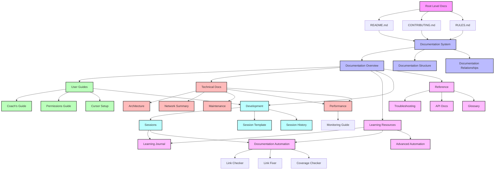
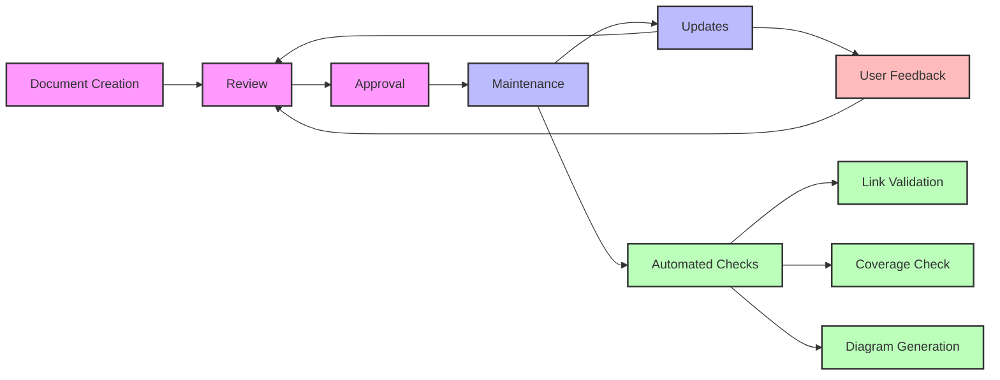

# Documentation Relationships

This diagram illustrates the relationships and flows between different types of documentation in our project.

## Documentation Lifecycle

## Key Relationships

1. **Core Documentation**
   - Root level documents define standards
   - Documentation system implements these standards
   - All other documentation follows these guidelines

2. **User Guides**
   - Based on core documentation standards
   - Referenced by technical documentation
   - Updated based on user feedback

3. **Technical Documentation**
   - Implements standards from core docs
   - Referenced by learning resources
   - Maintains performance standards

4. **Learning Resources**
   - Tracks progress in technical areas
   - Influences documentation updates
   - Guides automation improvements

5. **Development Documentation**
   - Follows session template
   - Links to learning resources
   - Maintains development history

6. **Reference Materials**
   - Supports all other documentation
   - Updated based on common issues
   - Maintains project terminology

## Maintenance Guidelines

1. **Regular Updates**
   - Review documentation monthly
   - Update based on user feedback
   - Maintain cross-references

2. **Automation**
   - Run link checks weekly
   - Update diagrams monthly
   - Monitor coverage regularly

3. **Quality Control**
   - Follow documentation standards
   - Maintain consistent formatting
   - Update outdated content

4. **Feedback Integration**
   - Collect user feedback
   - Address common issues
   - Update reference materials 