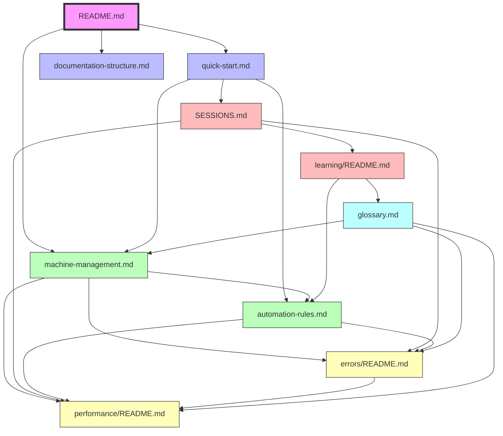
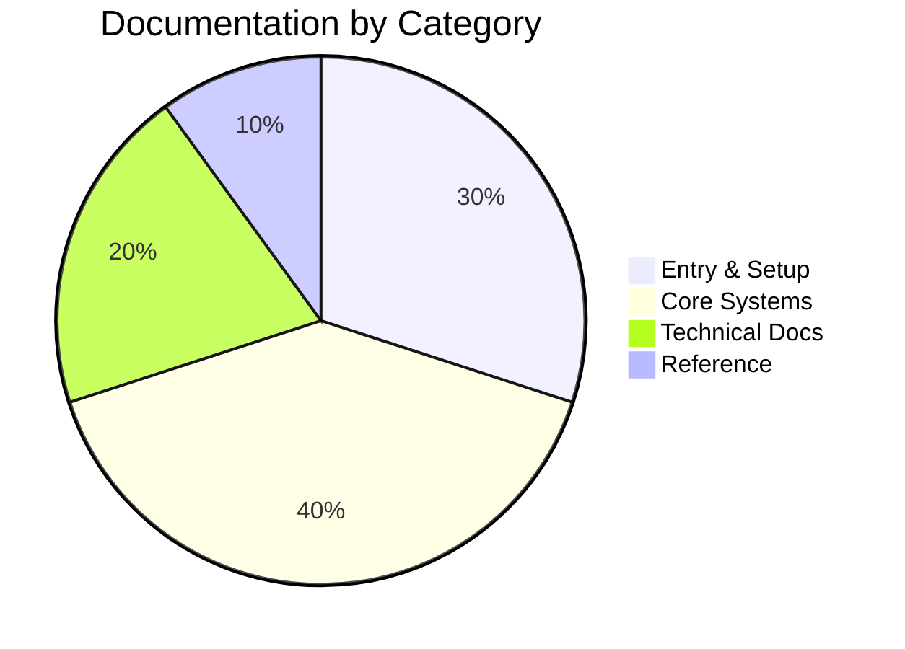
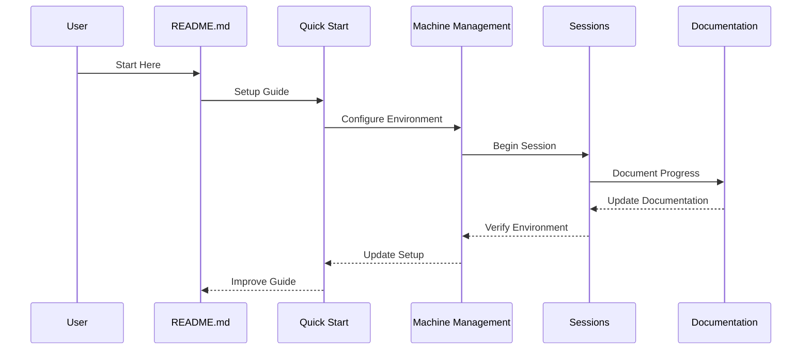

# Documentation Relationships

This diagram shows how different parts of our documentation system connect and relate to each other.

## Overview Diagram

## Documentation Categories

## Documentation Flow

## Key

1. **Entry Points** (Pink)
   - README.md
   - Quick Start
   - Documentation Structure

2. **Core Systems** (Green)
   - Machine Management
   - Automation Rules

3. **Development Flow** (Red)
   - Sessions
   - Learning

4. **Technical Documentation** (Yellow)
   - Errors
   - Performance

5. **Reference** (Blue)
   - Glossary

## Usage

This diagram helps visualize:
1. How documentation pieces connect
2. Natural progression through docs
3. Related documentation sections
4. Documentation categories
5. Information flow

Use this diagram to:
- Find related documentation
- Understand document dependencies
- Navigate the documentation system
- Plan documentation updates

Remember: All documentation relationships are maintained automatically through our documentation automation system. 