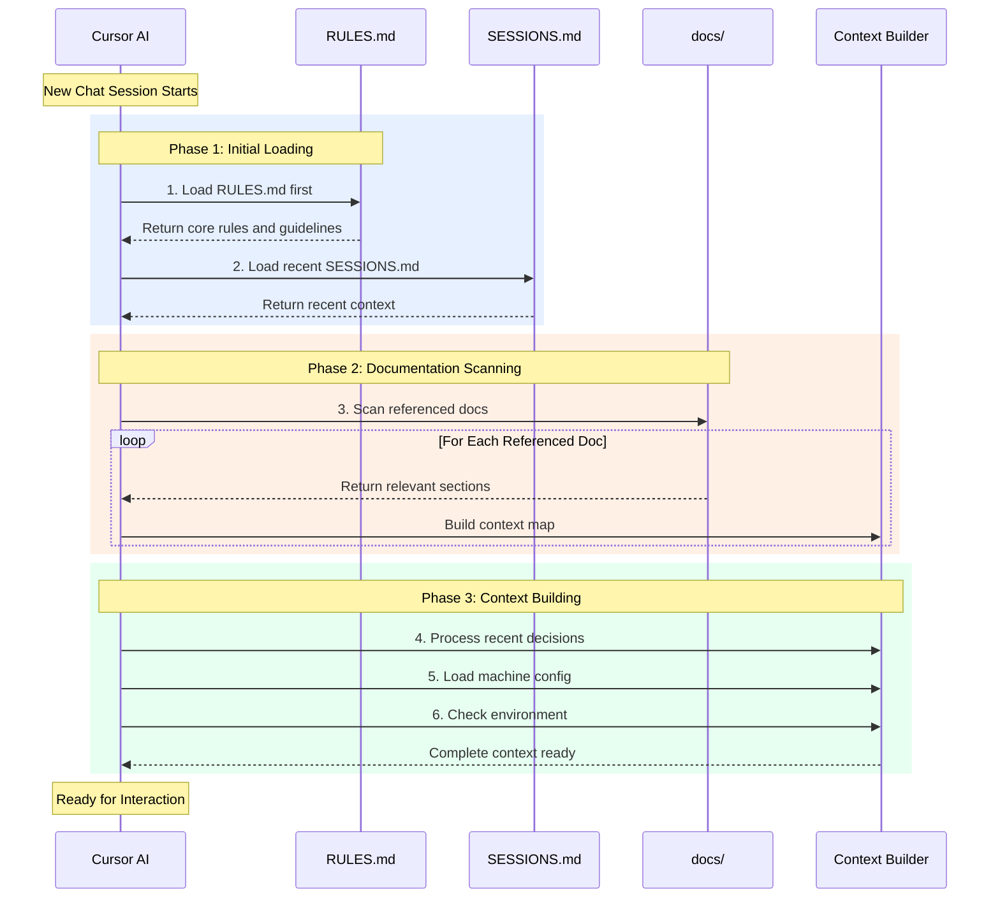
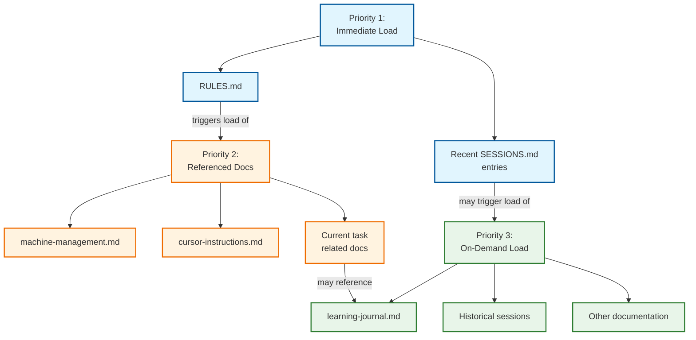

# Guide to Interactive Node Network Project Documentation
Hi Coach Michael,

Following up on our Discord conversation, I wanted to share how I've structured the documentation for this project. As someone coming from a non-developer background, I've tried to create a clear system for organizing project knowledge and development rules.

## Key Documentation Files

### 1. Root Level Documents
- [`RULES.md`](../../RULES.md) - Core development rules and guidelines
- [`README.md`](../../README.md) - Project overview and setup instructions
- [`NOTES.md`](../../NOTES.md) - Project notes and architectural decisions
- [`SESSIONS.md`](../../SESSIONS.md) - Tracks development sessions and decisions

### 2. Guides and Documentation
- [`docs/guides/cursor-instructions.md`](../guides/cursor-instructions.md) - Guidelines for using Cursor AI
- [`docs/guides/permissions-guide.md`](../guides/permissions-guide.md) - Access and security rules
- [`docs/guides/coach-michael-stolarz-guide.md`](../guides/coach-michael-stolarz-guide.md) - This guide

### 3. Technical Documentation
- [`docs/technical/node-network-summary.md`](../technical/node-network-summary.md) - Network visualization details
- [`docs/documentation-structure.md`](../documentation-structure.md) - Documentation organization
- [`docs/diagrams/`](../diagrams/) - Visual documentation and relationships
  - [`doc-relationships.md`](../diagrams/doc-relationships.md) - Documentation connections
  - [`project-structure.md`](../diagrams/project-structure.md) - Project organization

### 4. Learning and Development
- [`docs/learning/README.md`](../learning/README.md) - Learning resources index
- [`docs/learning/learning-journal.md`](../learning/learning-journal.md) - Progress tracking
- [`docs/learning/advanced-automation.md`](../learning/advanced-automation.md) - Advanced features
- [`docs/learning/documentation-automation.md`](../learning/documentation-automation.md) - Doc management

### 5. Performance and Monitoring
- [`docs/performance/README.md`](../performance/README.md) - Performance metrics
- [`docs/performance/monitoring.md`](../performance/monitoring.md) - System monitoring

## Documentation Structure

I've organized the documentation with a few key principles:

1. **Root Level Documents**
   - Core rules and guidelines (`RULES.md`)
   - Project overview (`README.md`)
   - Session tracking (`SESSIONS.md`)
   - Project notes (`NOTES.md`)

2. **Organized Documentation**
   - Guides in `docs/guides/`
   - Technical docs in `docs/technical/`
   - Learning resources in `docs/learning/`
   - Performance docs in `docs/performance/`
   - Visual docs in `docs/diagrams/`

3. **Learning Focus**
   - Documented learning process in `docs/learning/`
   - Clear guides for different aspects
   - Comprehensive technical documentation

4. **Project Evolution**
   - Session-based development tracking
   - Decision documentation
   - Progress monitoring
   - Automated documentation updates

## File Relationship Diagram

```mermaid
graph TD
    %% Root Level Documents
    ROOT[Project Root] --> RULES[RULES.md]
    ROOT --> README[README.md]
    ROOT --> NOTES[NOTES.md]
    ROOT --> SESSIONS[SESSIONS.md]
    
    %% Main Directories
    ROOT --> DOCS[docs/]
    ROOT --> SRC[src/]
    ROOT --> SCRIPTS[scripts/]
    
    %% Documentation Directory
    DOCS --> GUIDES[guides/]
    DOCS --> TECHNICAL[technical/]
    DOCS --> DIAGRAMS[diagrams/]
    DOCS --> LEARNING[learning/]
    DOCS --> PERF[performance/]
    DOCS --> ERRORS[errors/]
    DOCS --> MACHINE[machine-management.md]
    
    %% Guides
    GUIDES --> COACH[coach-michael-stolarz-guide.md]
    GUIDES --> CURSOR[cursor-instructions.md]
    GUIDES --> PERMS[permissions-guide.md]
    
    %% Technical Documentation
    TECHNICAL --> NETWORK[node-network-summary.md]
    
    %% Diagrams
    DIAGRAMS --> DOC_REL[doc-relationships.md]
    DIAGRAMS --> PROJ_STR[project-structure.md]
    
    %% Learning Documentation
    LEARNING --> JOURNAL[learning-journal.md]
    LEARNING --> LEARN_README[README.md]
    LEARNING --> ADV_AUTO[advanced-automation.md]
    LEARNING --> DOC_AUTO[documentation-automation.md]
    
    %% Performance Documentation
    PERF --> PERF_README[README.md]
    PERF --> MONITOR[monitoring.md]
    
    %% Source Code
    SRC --> COMPONENTS[components/]
    COMPONENTS --> INT_NODE[InteractiveNodeNetwork.tsx]
    COMPONENTS --> NET_WRAP[NodeNetworkWrapper.tsx]
    COMPONENTS --> NET_CTRL[NetworkVisualizationController.tsx]
    
    %% Scripts
    SCRIPTS --> DOC_SCRIPTS[docs/]
    SCRIPTS --> SETUP[setup-machine.ts]
    SCRIPTS --> TESTS[tests/]
    
    %% Relationships and Dependencies
    RULES -.-> |references| DOCS
    SESSIONS -.-> |updates| JOURNAL
    DOC_SCRIPTS -.-> |manages| DOCS
    SETUP -.-> |configures| MACHINE
    
    %% Styling
    classDef default fill:#f9f9f9,stroke:#333,stroke-width:2px;
    classDef root fill:#e1f5fe,stroke:#01579b,stroke-width:2px;
    classDef docs fill:#e8f5e9,stroke:#2e7d32,stroke-width:2px;
    classDef guides fill:#fff3e0,stroke:#ef6c00,stroke-width:2px;
    classDef technical fill:#fce4ec,stroke:#c2185b,stroke-width:2px;
    classDef src fill:#f3e5f5,stroke:#7b1fa2,stroke-width:2px;
    classDef scripts fill:#e8eaf6,stroke:#3f51b5,stroke-width:2px;
    
    class ROOT root;
    class DOCS,LEARNING,PERF,ERRORS docs;
    class GUIDES,COACH,CURSOR,PERMS guides;
    class TECHNICAL,NETWORK technical;
    class SRC,COMPONENTS src;
    class SCRIPTS,DOC_SCRIPTS,SETUP,TESTS scripts;
```

### Key File Relationships

1. **Root Level Documents**
   - Core project files remain in root for easy access
   - `RULES.md`, `README.md`, `SESSIONS.md`, and `NOTES.md`
   - Direct links to organized documentation sections

2. **Documentation Organization**
   - `docs/guides/` for user and process guides
   - `docs/technical/` for implementation details
   - `docs/diagrams/` for visual documentation
   - `docs/learning/` for educational resources
   - `docs/performance/` for monitoring and metrics

3. **Source Code Organization**
   - `src/components/` contains core visualization components
   - Each component has a specific responsibility
   - Components designed for reusability

4. **Automation and Scripts**
   - `scripts/` directory manages automation
   - Documentation is automatically maintained
   - Machine configuration handled systematically

## AI Initialization and File Review Process

### AI Review Process Explanation

1. **Initial Loading Phase**
   - AI immediately loads `RULES.md` on chat start
   - Processes core guidelines and protocols
   - Loads recent `SESSIONS.md` entries
   - Establishes baseline context

2. **Documentation Scanning Phase**
   - Follows references from `RULES.md`
   - Scans relevant documentation sections
   - Builds cross-reference map
   - Prioritizes recent and relevant content

3. **Context Building Phase**
   - Processes recent project decisions
   - Loads machine-specific configurations
   - Verifies environment settings
   - Establishes complete interaction context

### File Review Priority

### Memory Management During Review

- **Priority 1 (Always Loaded)**
  * Complete `RULES.md` content
  * Most recent session summary
  * Current machine configuration

- **Priority 2 (Task-Dependent)**
  * Documentation referenced by current task
  * Relevant machine-specific settings
  * Active session context

- **Priority 3 (On-Demand)**
  * Historical session data
  * Older learning journal entries
  * Supplementary documentation

## Novel AI Interaction Rules

I've developed some unique approaches to working with Cursor AI that might interest you as an educator. These rules help create a more intuitive development experience for non-developers:

### 1. Educational Support Triggers
- AI automatically offers explanations when encountering new technical concepts
- Uses a simple y/n choice system for requesting detailed explanations
- Breaks down complex topics into digestible options (y1, y2, y3 for different aspects)
- Waits for user response before proceeding with technical details

### 2. Session Management Automation
- AI proactively suggests starting new sessions to prevent memory issues
- Automatically generates session summaries
- Tracks decisions and learning opportunities
- Maintains context between development sessions
- Monitors chat memory consumption and suggests new sessions when:
  * Chat duration exceeds 1 hour
  * Complex operations are complete
  * Major milestones are reached
  * Context switching is about to occur
  * Memory usage approaches 80%
  * Before starting new major features

### 3. Documentation Integration
- AI suggests updates to documentation files when relevant
- Creates specialized .md files for complex topics
- Maintains cross-references between related concepts
- Keeps documentation DRY (Don't Repeat Yourself)
- Automatically updates documentation on:
  * New features added
  * API changes
  * Dependencies updated
  * Setup requirements changed
  * Project structure changes

### 4. Learning Capture System
- Automatically identifies learning opportunities during development
- Suggests additions to the learning journal
- Creates cross-references in documentation
- Updates glossary with new terms
- Captures learning opportunities when:
  * New technical concept is introduced
  * New tool or library is used
  * New pattern or practice is implemented
  * User asks a question about functionality
  * Error or issue resolution provides insight

### 5. Machine Configuration Management
- Detects development environment changes
- Verifies tool installations and configurations
- Manages machine-specific settings
- Ensures consistent development environments
- Automatically checks when:
  * Starting new sessions
  * Workspace path changes
  * Shell environment changes
  * System information changes

### 6. Context-Aware Assistance
- Monitors for task interruptions
- Manages multiple ongoing tasks
- Preserves context between sessions
- Provides relevant documentation references

### 7. Error Handling and Recovery
- Explains errors in plain language
- Provides context about error causes
- Suggests possible solutions
- Documents error resolutions for future reference
- Implements automated recovery procedures for:
  * Corrupted documentation
  * Environment issues
  * Configuration problems
  * Session management errors

### 8. Command Execution Safety
- Always shows commands before executing them
- Explains what each command does
- Indicates if commands require user approval
- Warns about potential risks or side effects
- Implements safety features:
  * Commands only run after code changes are accepted
  * Explicit approval required for critical operations
  * Clear explanation of command impacts
  * Automatic rollback capabilities

### 9. Documentation Health Monitoring
- Tracks documentation coverage
- Verifies cross-references
- Ensures consistent formatting
- Maintains documentation relationships
- Automated checks for:
  * Missing documentation
  * Broken links
  * Outdated content
  * Inconsistent formatting

### 10. Version Control Integration
- Clear and descriptive commit messages
- Grouped related changes
- User confirmation before pushing
- Maintains stable main branch
- Automated processes for:
  * Documentation updates
  * Version synchronization
  * Change tracking
  * Release management

## Current Focus Areas

1. **Background Graph Controller**
   - Customizable node colors
   - Movement controls
   - Visual parameters

2. **Future Plans**
   - Figma integration for improved UI
   - Potential Framer community component
   - Enhanced design system

## Next Steps

1. **Two-Hour Session Planning**
   - UI refinement with Figma
   - Design system implementation
   - Component optimization

2. **Documentation Refinement**
   - Would love your feedback on the structure
   - Suggestions for optimization
   - Ideas for better organization

## Repository Access
The project is currently public and can be accessed at:
https://github.com/ronanchris/interactive-node-network

Looking forward to your thoughts on how we can optimize both the documentation and development process.

Best,
Chris 